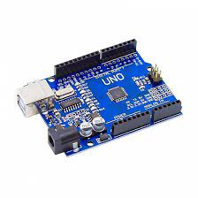
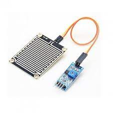
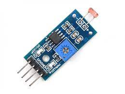
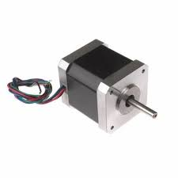
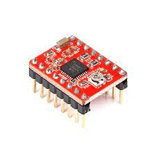
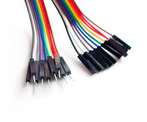

# ClothesCare-Automation
Automated weather-based clothes protection system using Arduino, rain/sunlight sensors, and a stepper motor.

# Door Control System with Rain and Sunlight Detection

The Door Control System with Rain and Sunlight Detection is an automated system designed to protect clothes from rain and snow. The project utilizes an Arduino board, rain and sunlight sensors, a stepper motor, a stepper motor driver module, and a chain drive mechanism to control the opening and closing of a door based on weather conditions. The system provides both automated and manual control options.

## Components Used

- Arduino board (e.g., Arduino Uno)
- Rain sensor module
- Light sensor module
- Stepper motor
- Stepper motor driver module
- Chain drive mechanism (e.g., sprockets, chain, and guides)
- Jumper wires
- Power supply (for Arduino board and motor)

## Description

The Door Control System with Rain and Sunlight Detection is designed to protect clothes from rain and snow by automating the opening and closing of a door using a chain drive mechanism. The system utilizes an Arduino board, rain and sunlight sensor modules, a stepper motor, a stepper motor driver module, and the chain drive components. The Arduino code reads analog values from the rain and sunlight sensors to determine weather conditions and control the stepper motor, which in turn operates the chain drive mechanism.

### Arduino Code Functionality

The Arduino code implements the following functionality:

- Reading analog values from the rain and sunlight sensor modules to detect weather conditions.
- Opening the door if rain is detected above the rain threshold.
- Closing the door if no sunlight is detected below the light threshold.
- Providing manual control options to override the automated system.

### Wiring and Ports

To connect the components, use the following wiring and ports:

#### Chain Drive Mechanism

- Connect the stepper motor to the chain drive mechanism, ensuring proper alignment and tension.
- Install sprockets and guides to guide the chain and provide smooth movement.

#### Wiring Connections

- Rain Sensor:
  - Connect the VCC pin of the rain sensor to the 5V pin on the Arduino board.
  - Connect the GND pin of the rain sensor to the GND pin on the Arduino board.
  - Connect the analog output pin of the rain sensor to any analog input pin on the Arduino board.

- Sunlight Sensor:
  - Connect the VCC pin of the sunlight sensor to the 5V pin on the Arduino board.
  - Connect the GND pin of the sunlight sensor to the GND pin on the Arduino board.
  - Connect the analog output pin of the sunlight sensor to any analog input pin on the Arduino board.

- Stepper Motor:
  - Connect the stepper motor's coil wires to the corresponding pins on the stepper motor driver module. Refer to the datasheet or documentation of your stepper motor for the specific wire configuration.
  - Connect the stepper motor driver module's control pins (STEP, DIR, and EN) to digital output pins on the Arduino board. Note the chosen pins for each connection.

- Stepper Motor Driver Module:
  - Connect the VCC and GND pins of the stepper motor driver module to the 5V and GND pins on the Arduino board, respectively.
  - Connect the control pins (STEP, DIR, and EN) of the stepper motor driver module to digital output pins on the Arduino board. Note the chosen pins for each connection.

#### Manual Control Ports

- Manual Button:
  - Connect one terminal of the manual button to a digital input pin on the Arduino board.
  - Connect the other terminal of the manual button to the GND pin on the Arduino board.

- Manual Potentiometer:
  - Connect one end of the potentiometer to the 5V.

# Door Control System with Rain and Sunlight Detection

This project implements a door control system using an Arduino board. The system includes rain and sunlight detection capabilities to protect clothes from rain and lack of sunlight. The code controls a stepper motor connected to a chain drive mechanism, allowing automated opening and closing based on weather conditions. Additionally, manual control is provided to override the automated functionality.

## Components Used

- Arduino board (e.g., Arduino Uno)
- Rain sensor module
- Light sensor module
- Stepper motor
- Stepper motor driver module
- Chain drive mechanism (e.g., sprockets, chain, and guides)
- Jumper wires
- Power supply (for Arduino board and motor)

## Description

The Door Control System with Rain and Sunlight Detection is designed to protect clothes from rain and snow by automating the opening and closing of a door using a chain drive mechanism. The system utilizes an Arduino board, rain and sunlight sensor modules, a stepper motor, a stepper motor driver module, and the chain drive components. The Arduino code reads analog values from the rain and sunlight sensors to determine weather conditions and control the stepper motor, which in turn operates the chain drive mechanism.

### Arduino Code Functionality

The Arduino code implements the following functionality:

- Reading analog values from the rain and sunlight sensor modules to detect weather conditions.
- Opening the door if rain is detected above the rain threshold.
- Closing the door if no sunlight is detected below the light threshold.
- Providing manual control options to override the automated system.

### Wiring and Ports

To connect the components, use the following wiring and ports:

#### Chain Drive Mechanism

- Connect the stepper motor to the chain drive mechanism, ensuring proper alignment and tension.
- Install sprockets and guides to guide the chain and provide smooth movement.

#### Wires Connection Ports

- Rain Sensor:
  - Connect the VCC pin of the rain sensor to the 5V pin on the Arduino board.
  - Connect the GND pin of the rain sensor to the GND pin on the Arduino board.
  - Connect the analog output pin of the rain sensor to any analog input pin on the Arduino board.

- Sunlight Sensor:
  - Connect the VCC pin of the sunlight sensor to the 5V pin on the Arduino board.
  - Connect the GND pin of the sunlight sensor to the GND pin on the Arduino board.
  - Connect the analog output pin of the sunlight sensor to any analog input pin on the Arduino board.

- Stepper Motor:
  - Connect the stepper motor's coil wires to the corresponding pins on the stepper motor driver module. Refer to the datasheet or documentation of your stepper motor for the specific wire configuration.
  - Connect the stepper motor driver module's control pins (STEP, DIR, and EN) to digital output pins on the Arduino board. Note the chosen pins for each connection.

- Stepper Motor Driver Module:
  - Connect the VCC and GND pins of the stepper motor driver module to the 5V and GND pins on the Arduino board, respectively.
  - Connect the control pins (STEP, DIR, and EN) of the stepper motor driver module to digital output pins on the Arduino board. Note the chosen pins for each connection.

#### Manual Control Ports

- Manual Button:
  - Connect one terminal of the manual button to a digital input pin on the Arduino board.
  - Connect the other terminal of the manual button to the GND pin on the Arduino board.

- Manual Potentiometer:
  - Connect one end of the potentiometer to the 5V pin on the Arduino board.
  - Connect the other end of the potentiometer to the GND pin on the Arduino board.
  - Connect the wiper (middle pin) of the potentiometer to an analog input pin on the Arduino board.


description:
The Arduino board reads analog values from the rain sensor and light sensor modules to determine weather conditions. The rain sensor, connected to pin A0, detects rain by measuring the analog output. The light sensor, connected to pin A1, detects sunlight based on the analog output. The code sets threshold values to determine rain and sunlight presence.

If rain is detected (analog value above the rain threshold), the code opens the door by running the motor in one direction. If no sunlight is detected (analog value below the light threshold), the code closes the door to protect from snow. The motor driver module is utilized to control the motor's direction and provide sufficient power.

Manual control is implemented through three digital pins. By sending signals to the respective pins, users can manually control the motor's forward, reverse, and stop functions, overriding the automated system.

Note:
This door control system with rain and sunlight detection offers an automated solution for protecting clothes from rain and lack of sunlight. The rain sensor detects rain, prompting the system to open the door. Similarly, the light sensor detects the absence of sunlight, leading to door closure for snow protection. Manual control is available for user intervention.

To use the system, assemble the required components and wire them according to the provided pin connections. Upload the provided Arduino code to the board and ensure that the necessary libraries for the sensors are installed. Connect an appropriate power supply for the Arduino and motor. Once powered on, the system will operate automatically based on weather conditions, while manual control can be utilized when desired.


## Project Overview

The weather-based door control system is designed to protect the door and its contents from rain and snow. The system detects weather conditions using the rain and sunlight sensors. When rain is detected, the stepper motor is activated to open the Huifebg umbrella door mechanism, providing a protective cover for the door. Similarly, when there is no sunlight detected (indicating snowfall), the door mechanism closes to prevent snow from entering.

The code in this repository, written in Arduino programming language, controls the stepper motor and communicates with the rain and sunlight sensors. It uses sensor readings to determine the appropriate actions for the door mechanism. Manual control functionality is also implemented, allowing users to override the automated system and control the stepper motor manually if needed.


     


## Components Used

### Arduino Board

The Arduino board acts as the central control unit for the project. It runs the Arduino code and facilitates communication between the sensors and the stepper motor. The program logic is implemented on the Arduino board, making it the brain of the weather-based door control system.

### Rain Sensor

The rain sensor is used to detect the presence of rain. It measures the moisture level in the environment and provides an analog output signal that is read by the Arduino board. Based on the readings, the Arduino determines whether to open the door or not to protect it from rain.

### Sunlight Sensor

The sunlight sensor detects the intensity of sunlight. It provides an analog output that is read by the Arduino board. When the sunlight sensor detects a low light intensity, indicating the absence of sunlight (e.g., during snowfall), the Arduino triggers the closing of the door mechanism to prevent snow from entering.

### Stepper Motor

The stepper motor is responsible for the movement of the door mechanism. It provides precise control over the opening and closing actions. The Arduino board communicates with the stepper motor via a motor driver module to command the desired rotations and direction. By controlling the stepper motor, the system can automate the door operation based on the weather conditions.

### Stepper Motor Driver Module

The stepper motor driver module acts as an interface between the Arduino board and the stepper motor. It receives commands from the Arduino and provides the necessary current and voltage levels to drive the stepper motor. The driver module ensures smooth and controlled movement of the motor, enabling precise door control in response to the weather conditions.

### Huifebg Umbrella Door Mechanism

The Huifebg umbrella door mechanism is a specialized component designed to provide weather protection for the door. It consists of an umbrella-like cover that can be opened or closed. When activated by the stepper motor, the umbrella door opens to shield the door and its contents from rain. Conversely, it closes to prevent snow from entering during snowfall. The Huifebg umbrella door mechanism ensures the safety and integrity of the door under various weather conditions.

## Source Code

```cpp
#include <Stepper.h>

// Define the number of steps per revolution for the stepper motor
const int stepsPerRevolution = 200;

// Create an instance of the Stepper class
Stepper motor(stepsPerRevolution, 8, 9, 10, 11);

// Pin connections for rain and light sensors
const int rainSensorPin = A0;
const int lightSensorPin = A1;

// Threshold values for rain and sunlight detection
const int rainThreshold = 500;
const int lightThreshold = 200;

// Variables to store the current state of the door
boolean doorOpen = false;

void setup() {
  // Set the motor speed
  motor.setSpeed(100);
  
  // Set the rain and light sensor pins as inputs
  pinMode(rainSensorPin, INPUT);
  pinMode(lightSensorPin, INPUT);
}

void loop() {
  // Read analog values from rain and light sensors
  int rainSensorValue = analogRead(rainSensorPin);
  int lightSensorValue = analogRead(lightSensorPin);
  
  // Check if it's raining
  if (rainSensorValue > rainThreshold) {
    if (!doorOpen) {
      openDoor();
    }
  }
  // Check if there is no sunlight (for snow protection)
  else if (lightSensorValue < lightThreshold) {
    if (doorOpen) {
      closeDoor();
    }
  }
}

// Function to open the door
void openDoor() {
  motor.step(stepsPerRevolution);
  doorOpen = true;
}

// Function to close the door
void closeDoor() {
  motor.step(-stepsPerRevolution);
  doorOpen = false;
}
```

## Code Explanation

The code consists of the following main sections:

### Libraries

The required libraries are included at the beginning of the code. In this project, the `Stepper` library is used to control the stepper motor.

### Variable Declarations

- `stepsPerRevolution`: This variable holds the number of steps per revolution for the stepper motor.

### Object Creation

- `motor`: An instance of the `Stepper` class is created using the `stepsPerRevolution` variable and specifying the pin connections for the motor coils.

### Pin Declarations

- `rainSensorPin`: The pin to which the rain sensor module is connected.
- `lightSensorPin`: The pin to which the light sensor module is connected.

### Thresholds

- `rainThreshold`: The threshold value for rain detection.
- `lightThreshold`: The threshold value for sunlight detection.

### Setup Function

The `setup()` function is called once when the Arduino board is powered on. It initializes the motor speed and sets the rain and light sensor pins as inputs.

### Loop Function

The `loop()` function is the main execution loop of the program. It performs the following tasks repeatedly:

- Read the analog values from the rain and light sensors using `analogRead()`.

- Check if it's raining by comparing the rain sensor value with the rain threshold. If rain is detected and the door is not already open, the `openDoor()` function is called.

- Check if there is no sunlight by comparing the light sensor value with the light threshold. If no sunlight is detected and the door is already open, the `closeDoor()` function is called.

### Open Door Function

The `openDoor()` function is responsible for opening the door. It calls the `step()` function of the `motor` object to rotate the stepper motor one revolution in the desired direction. The `doorOpen` variable is updated to reflect the current state of the door.

### Close Door Function

The `closeDoor()` function is responsible for closing the door. It calls the `step()` function of the `motor` object to rotate the stepper motor one revolution in the opposite direction. The `doorOpen` variable is updated to reflect the current state of the door.
